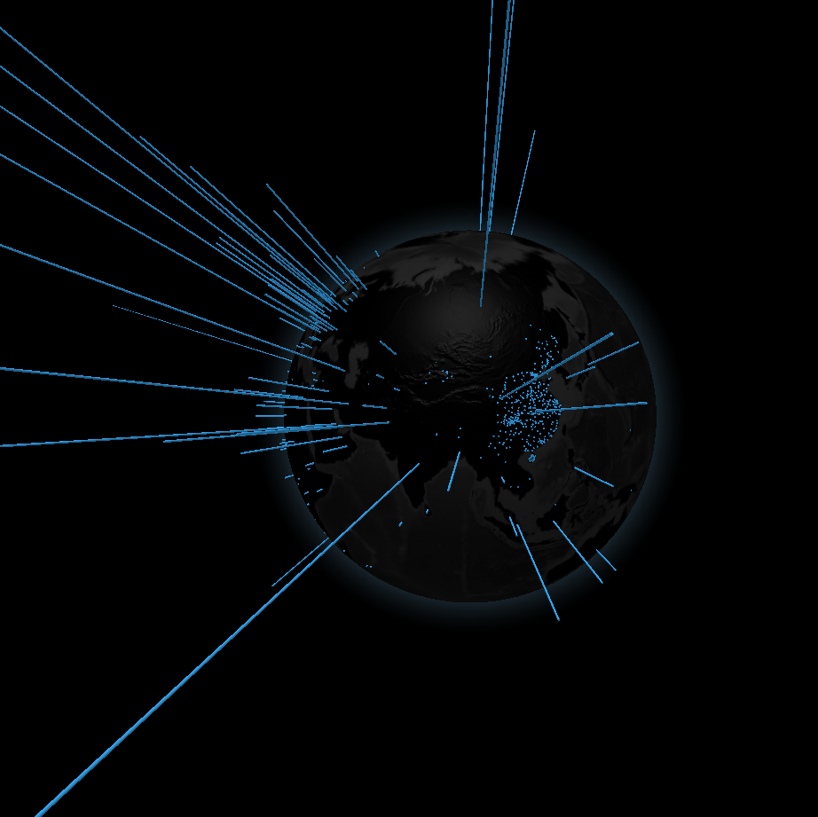

# COVID19 (Coronavirus) Globe Visualization Live
COVID19 Globe Visualization Live is a visualizaton of COVID19 on a globe. Data points at each location can represent number of confirmed cases, deaths, or cured cases. The height of each data bar represents its proportion relative to all other locations. All data are updated every hour to maintain accuracy.

## Built with
- Node.js
- SQLite 3
- Three.js
- HTML/CSS/Javascript
- Google Cloud Geocoding API
- DXY-COVID-19-Crawler by BlankerL (COVID19 data API)

## Things I learned
- Deep understanding in asynchronous JavaScript programming
- Work with APIs with efficiency: requests rate limits, lag, check data's validity
- Parse and clean data
- connect frontend and backend

## Visuals

